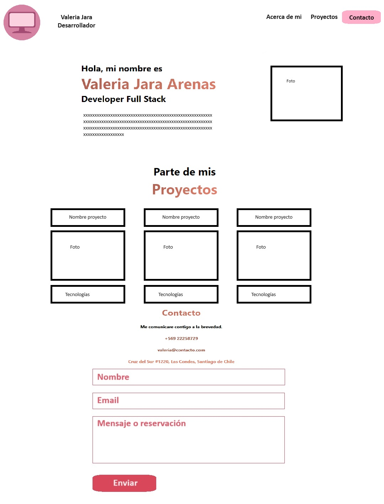

# PROYECTO 6: PORTAFOLIO

## **ÍNDICE**

* [1. Intro](#1-intro)
* [2. Prototipo](#2-prototipo)
* [3. Requisitos](#3-requisitos-y-entregables)
* [4. Criterios de evaluación](#4-criterios-de-evaluaci%C3%B3n)

## 1. Intro
Se desarrolla el sexto y último proyecto del Bootcamp, llamado "Portafolio". 
El proyecto se enfocó en la creación de una página web que incluye todos los proyectos desarrollados a lo largo del bootcamp, utilizando React. La página web incluye sección "acerca de mi", formulario de contacto, una sección de datos de ubicación y correo electrónico y footer.

## 2. Prototipo

## 3. Requisitos y entregables

### GENERAL

- [ ] Realizarse de manera individual.
- [ ] Descripción de tu perfil profesional (tu nombre, área de contacto, redes profesionales como Linkedin o GitHub)
- [ ] Hablar sobre tus habilidades / conocimientos, incluyendo las tecnologías que sabes (MongoDB, Express, React, Node, JavaScript, etc)

### UI

- [ ] Aplicar código semántico y con buenas prácticas usando NextJS.
- [ ] Aplicar estilos utilizando clases de TailwindCSS.

### CONTROL DE VERSIONES
- [ ] Crear un repositorio en GitHub.
- [ ] Realizar "commits" en tu repositorio, mínimo 5.

### DESPLIEGUE
- [ ] Crear una URL para compartir (puedes utilizar Netlify o GitHub Pages).
- [ ] Colocar descripción dentro del repositorio.

****

## 4. Criterios de evaluación

| ÁREA       | % DEL TOTAL |
| ------------- |:-------------:|
| GENERAL      | 10%     |
| UI      | 60%     |
| CONTROL DE VERSIONES | 15%      |
| DESPLIEGUE | 15%      |

****

****
